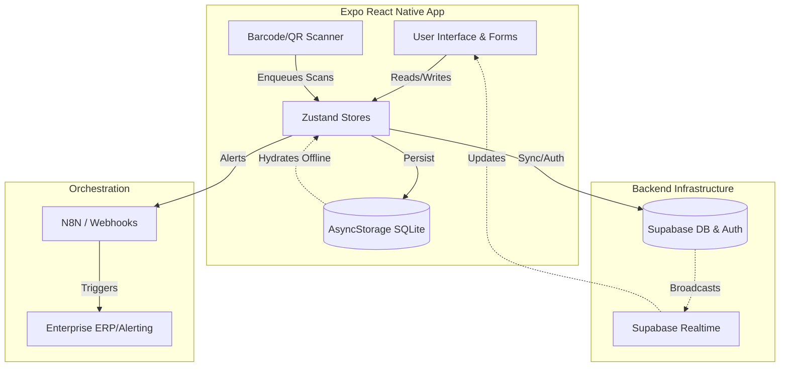
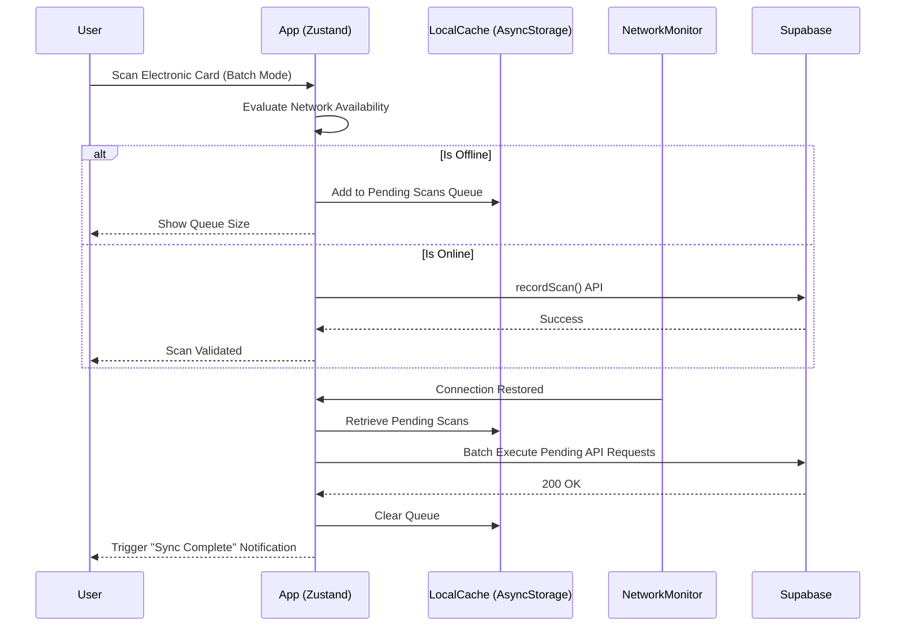
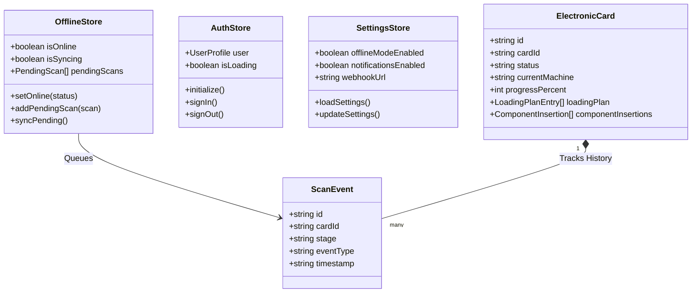

# SmartTrack (CardTrack)

**SmartTrack** is an advanced, offline-first production tracking application engineered to trace and manage Electronic Cards across assembly lines, testing stations, and QC operations. The application is built using React Native (Expo) and integrates deeply with Supabase and n8n webhooks for global automation.

## 🚀 Key Features

- **Offline-First Synchronization**: Capable of continuing full operations in complete network isolation using an intelligent local AsyncStorage queue system with `Zustand`.
- **Batch Processing**: Enqueue multiple QR code / Barcode scans rapidly without network overhead and push them synchronously when required.
- **Role-Based Access Control**: Strict segregation of Operator, Supervisor, and Administrator roles with specialized tools tailored to their responsibilities.
- **Intelligent Push Notifications**: Automated notifications for workflow progress, anomalies, testing intervention requests, and offline sync recoveries.
- **Rich Analytics & Global Leaderboards**: Instantly visualizes throughput, machine bottlenecks, current active workloads, and gamified operator metrics.
- **WebHooks & n8n Compatibility**: Allows instant bridging to massive, pre-existing enterprise orchestration pipelines.

---

## 🏗️ Architecture Diagrams

### 1. Global Architecture

The SmartTrack ecosystem heavily leverages a client-side architecture backed by Supabase with optional orchestration via webhooks.



### 2. Offline Sync Sequence

When operators traverse manufacturing areas lacking WiFi coverage, SmartTrack ensures continuous operation.



### 3. Core Class & State Diagram

The fundamental domain entities and state stores utilized by the platform.



---

## 📦 Tech Stack

| Technology | Purpose |
| ---------- | ------- |
| **Expo (React Native)** | Cross-platform core framework for iOS, Android, and Web. |
| **Zustand** | Lightweight, rapid state management utilized for Authentication, Settings, and Offline Queues. |
| **Expo Notifications** | Delivery mechanism for automated application alerts and sync confirmations. |
| **Supabase** | Backend-as-a-Service providing PostgreSQL, Auth, and RLS policies. |
| **TailwindCSS (NativeWind)** | Accelerated UI styling logic. |

## 🛠️ Configuration & Setup

1. **Environment Initialization:**
   Rename `.env.local.example` to `.env.local` and add your database configuration:
   ```bash
   EXPO_PUBLIC_SUPABASE_URL=https://your-project.supabase.co
   EXPO_PUBLIC_SUPABASE_ANON_KEY=your-anon-key
   ```

2. **Package Installation:**
   Use bun for lightning-fast resolving:
   ```bash
   bun install
   ```

3. **Running the Platform:**
   ```bash
   bun run start       # Starts the Expo Metro bundler
   bun run start:web   # Launches specifically for the web
   bun run start:ios   # Launches iOS Simulator
   bun run start:android # Launches Android Emulator
   ```

## 🔒 Security

All reads and writes are protected strictly by Supabase's **Row Level Security (RLS)** ensuring operators can only modify data aligned with their currently assigned department, whilst administrators maintain super-user privileges.