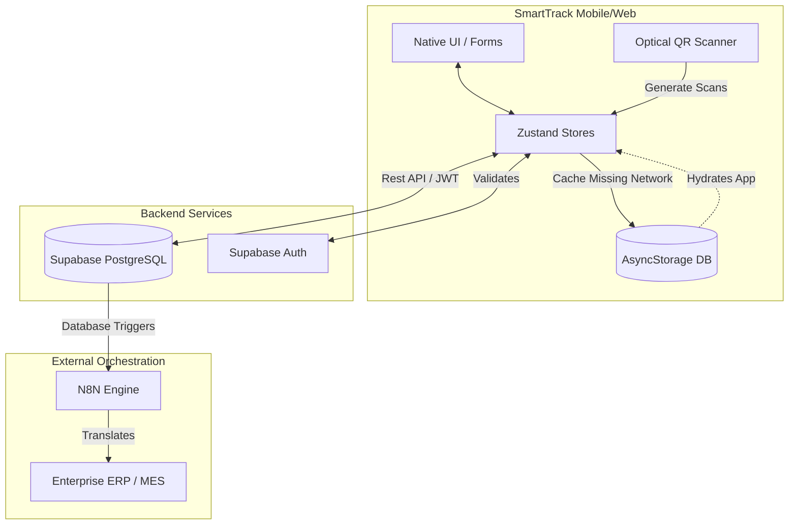
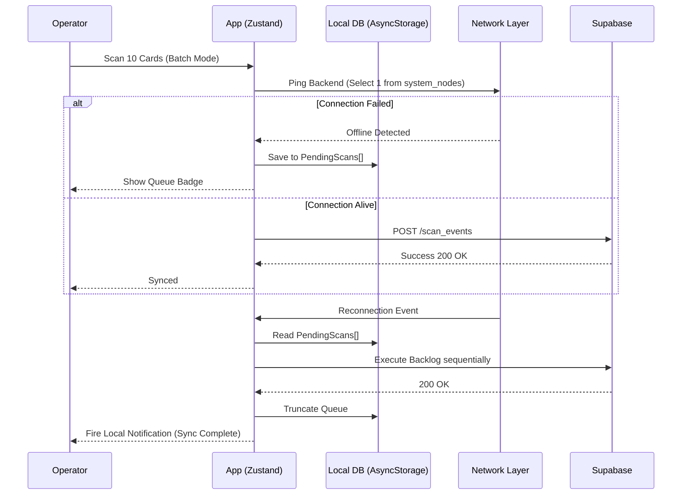
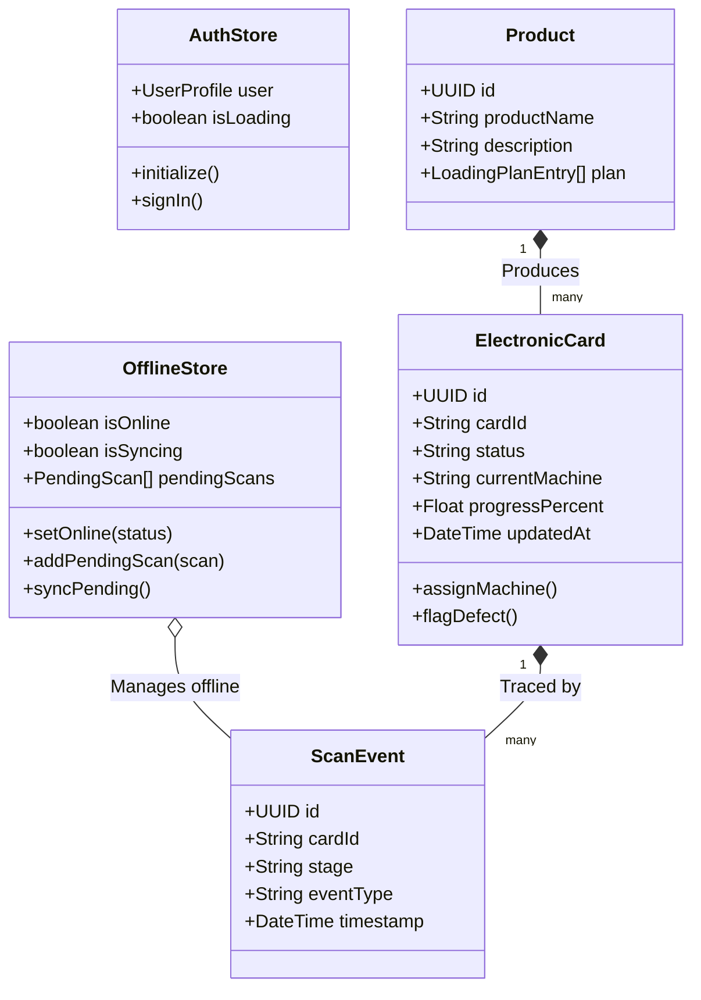

# SmartTrack: Comprehensive Technical Project Report

## 1. Executive Summary

**SmartTrack** is an advanced, offline-first production tracking ecosystem specifically engineered for the manufacturing and electronics assembly industry. It modernizes legacy assembly pipelines by replacing paper-based tracking with real-time, digital electronic card traceability using QR/Barcode scanning. 

The application ensures unbroken visibility over production stages, quality assurance workflows, and machine operator productivity, even in complete isolation from a network, thanks to its robust offline synchronization capabilities. 

---

## 2. Problem Statement & Objectives

### The Problem
Traditional manufacturing floors often suffer from:
- **Blind Spots:** Lack of real-time visibility into the exact location or status of electronic components.
- **Network Instability:** Hardware and concrete environments commonly block WiFi signals, rendering cloud-first applications useless.
- **Reporting Delays:** End-of-day manual tallying of production throughput prevents agile decision-making.
- **Accountability Loss:** Difficulty tracing which operator handled which batch, and exactly when anomalies occurred.

### Objectives
1. **Uninterrupted Operations (Offline-First):** Develop an application that functions fully without an active internet connection.
2. **Speed & Efficiency (Batch Mode):** Allow operators to rapidly scan large batches of components simultaneously.
3. **Real-time Analytics:** Provide supervisors with live, actionable metrics regarding production speed and bottlenecks.
4. **Proactive Alerting:** Push notifications for critical events, such as a blocked assembly line or offline sync recoveries.

---

## 3. Technology Stack

SmartTrack utilizes a modern, reactive, and cross-platform stack:

- **Frontend & Mobile Client:** React Native, Expo, and Expo Router (delivers native iOS, Android, and Web applications from a single codebase).
- **Styling:** TailwindCSS (via NativeWind) for responsive, adaptive, and scalable design.
- **State & Local Storage:** Zustand combined with React Native `AsyncStorage` for rapid state updates and local SQLite persistence.
- **Backend & Database:** Supabase (PostgreSQL, Row-Level Security, Authentication, Real-Time subscriptions).
- **Notifications:** Expo Notifications for scheduled local alerts and cross-platform push messages.
- **External Orchestration:** n8n integrations and Webhooks for connecting the system to external ERP software.

---

## 4. Core Modules & Functionalities

### 4.1. The Scanner & Batch Processor
The heart of SmartTrack. Operators use device cameras or manual entry to log components.
- **Optical Reader:** Instantly parses complex barcodes/QRs for `Card IDs`.
- **Batch Processing Mode:** Allows operators to rapidly scan 10, 20, or 50 cards consecutively. The scans are queued silently in memory and committed simultaneously to the database only when the operator finalizes the session, saving significant bandwidth and time.

### 4.2. Offline Storage & Intelligent Synchronization
If the device loses connectivity:
- The system intercepts the `fetch` failure automatically.
- Validates the local session securely.
- Stores the actions sequentially in an `AsyncStorage` queue.
- `useOfflineSync` constantly monitors `navigator.onLine` and a lightweight Supabase RPC ping.
- Once connectivity is restored, the queue is drained sequentially. A **Local Notification** alerts the user once the backlog has fully synced.

### 4.3. Leaderboard & Analytics
- **Dashboard:** Visually maps total workloads across specific machines (e.g., SMT, THT, Assembly, QC).
- **Leaderboard:** Applies gamification. It calculates `cardsScanned` and `avgTimeMinutes` per operator, ranking the factory floor to boost engagement and productivity.

### 4.4. Role-Based Administration
- **Operators:** Can only scan components, report defects, and view their own analytics.
- **Supervisors:** Can re-assign workloads, unblock halted machines, request specialized testing teams, and view the global factory throughput.
- **Administrators:** Can manage external webhooks, manage user roles, and export massive CSV reports of the raw scan databases.

---

## 5. System Diagrams & UML Models

The following architectural models illustrate the structural integrity of SmartTrack.

### 5.1. Global Architecture Diagram

### 5.2. Offline Sync Sequence Diagram

Demonstrates how the offline queuing engine safely prevents data loss.

### 5.3. State & Domain Class Diagram

Outlines the underlying data structures supporting the offline-first React context.

---

## 6. Security & Authentication Model

SmartTrack strictly relies on zero-trust methodologies from edge device to database:
1. **JWT Expiration & Refreshing:** Expo's secure enclave holds an encrypted Supabase JWT, which automatically requests a new refresh token silently in the background on valid app state changes.
2. **Row-Level Security (RLS):** Queries sent from the client have policies appended by PostgreSQL at the database layer. Operators attempting to query arbitrary user data automatically receive empty arrays `[]` from the backend, circumventing any malicious client modifications.
3. **Data Anonymization:** Exported CSV reports utilize edge functions to sanitize phone numbers and direct employee identifiable metadata depending on the user's requesting role scope.

## 7. Conclusion

SmartTrack directly bridges the gap between chaotic physical manufacturing environments and pristine digital orchestration. By heavily adopting an offline-first strategy paired with hardware-optimized scanning arrays, the system guarantees 100% throughput tracking accuracy without sacrificing user experience or slowing down physical assembly lines.
